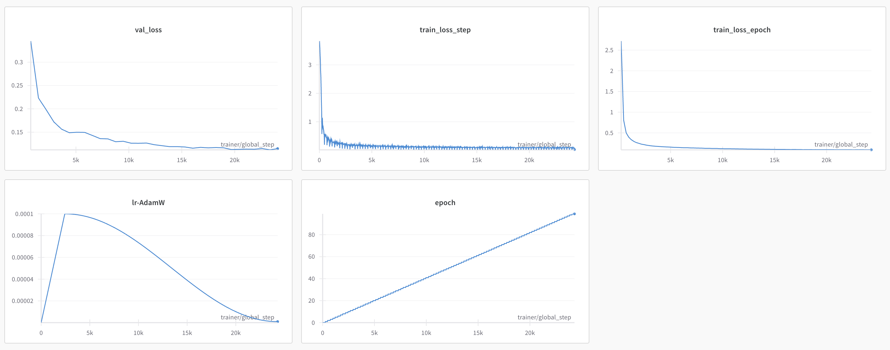
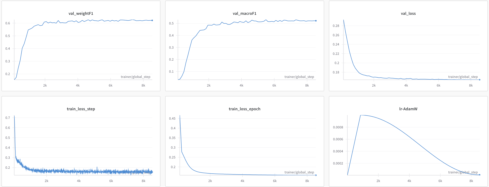

# 🎬 CoMM Reimplementation (MM-IMDb)

This project is a implementation of the paper  
**"What to Align in Multimodal Contrastive Learning?"**  
**[arXiv:2409.07402](https://arxiv.org/abs/2409.07402)**

---

## 📌 Task

The goal is **multilabel classification** of movies using the **MM-IMDb** dataset.  
Each movie contains:

- A **poster image** (visual modality)
- A **plot summary** (text modality)
- One or more **genre labels** (multilabel targets)

---

## 🧠 Motivation

Multimodal contrastive models like **CLIP** only capture **redundant** (shared) information across modalities.  
However, many tasks — like genre prediction — require:

- **Unique information** (U): Found only in one modality
- **Redundant information** (R): Found in both
- **Synergistic information** (S): Only emerges when both are combined

> CoMM proposes a **contrastive objective** and **fusion architecture** that explicitly learns to capture R, U, and S.

---

## 🏗️ Architecture


### 🔹 Encoders

- **Image encoder**: [BLIP-2](https://huggingface.co/docs/transformers/model_doc/blip-2) (ViT-based, frozen)
- **Text encoder**: BLIP-2's pretrained language encoder (frozen)

### 🔹 Latent Converters

- Each encoder output is projected into a **sequence of embeddings**
- These are concatenated and passed to a **shared Transformer fusion module**

### 🔹 Fusion Transformer

- 1 layer, 8 heads
- Adds a `[CLS]` token to capture the joint multimodal embedding
- Output dim: **768**

### 🔹 Critic MLP (for contrastive pretraining)

- Maps `[CLS]` embedding to **256-dim** vector
- Used to compute InfoNCE-based similarity

---

## 🧪 Pretraining Loss: `L_CoMM`

CoMM trains by maximizing agreement between **augmented multimodal views** and **masked modality views**.

### InfoNCE Estimator

The InfoNCE estimator is defined as:

```math
\hat{I}_{\text{NCE}}(Z, Z') = \mathbb{E}_{z,z'_{\text{pos}} \sim p(Z,Z')} \left[ \log \frac{\exp \text{sim}(z, z'_{\text{pos}})}{\sum_{z'_{\text{neg}}} \exp \text{sim}(z, z'_{\text{neg}})} \right]
```

### CoMM Loss Function

Given this estimator, our final training loss can be written as:
```math 
\mathcal{L}_{\text{CoMM}} = -\underbrace{\hat{I}_{\text{NCE}}(Z', Z'')}_{\approx R+S+\sum_{i=1}^{n} U_i} - \sum_{i=1}^{n} \frac{1}{2} \underbrace{\left(\hat{I}_{\text{NCE}}(Z_i, Z') + \hat{I}_{\text{NCE}}(Z_i, Z'')\right)}_{\approx R+U_i} =: \mathcal{L} + \sum_{i=1}^{n} \mathcal{L}_i \quad (7)
```
Where:
- **Z'** and **Z''** are augmented multimodal representations
- **Z_i** represents single-modality representations  
- The loss captures **R** (redundant), **U** (unique), and **S** (synergistic) information

---

## 📊 Results

### Pretraining Metrics



The pretraining phase shows:
- **Training Loss**: Steady convergence from ~2.5 to ~0.15 over 100 epochs
- **Validation Loss**: Consistent decrease from ~0.32 to ~0.12
- **Learning Rate**: Proper warmup and cosine annealing schedule
- **Global Steps**: ~25k training steps total

### Fine-tuning Performance



The fine-tuning results demonstrate:
- **Weighted F1**: Reaches ~0.62 on validation set
- **Macro F1**: Achieves ~0.53 performance
- **Training Loss**: Quick convergence in fine-tuning phase
- **Learning Rate**: Effective learning rate scheduling during fine-tuning

> **Important**: During fine-tuning for genre classification, the **CoMM contrastive components** (fusion transformer and critic MLP) were **frozen**. Only a new classification head was trained on top of the pretrained multimodal representations.

---

## 🚀 Setup and Usage

### Prerequisites

Ensure you have the following packages installed:

```bash
pip install -r requirements.txt
```

### Data Preparation

1. **Download the Dataset**: Use the provided `download.ipynb` to download and prepare the MM-IMDb dataset.
2. **Process the Data**: Ensure the data is split into train, validation, and test sets.

### Training

- **Pretraining**: Run `pretraining_train.py` to pretrain the CoMM model.
- **Fine-tuning**: Use `finetuning.py` to fine-tune the model for genre classification.

### Testing

Evaluate the fine-tuned model using the test set to obtain final metrics.

---

## 📂 Project Structure

- **src/models**: Contains the CoMM model implementation.
- **src/dataloaders**: Data loading and processing scripts.
- **src/utils**: Utility functions and helpers.
- **download.ipynb**: Notebook for downloading and preparing the dataset.
- **pretraining_train.py**: Script for pretraining the CoMM model.
- **finetuning.py**: Script for fine-tuning the model for classification.

---

## 📈 Final Test Evaluation

Final Test Evaluation was done on unseen test data.

**Test Set Results:**
- **Macro F1**: 0.5572
- **Weighted F1**: 0.6326


